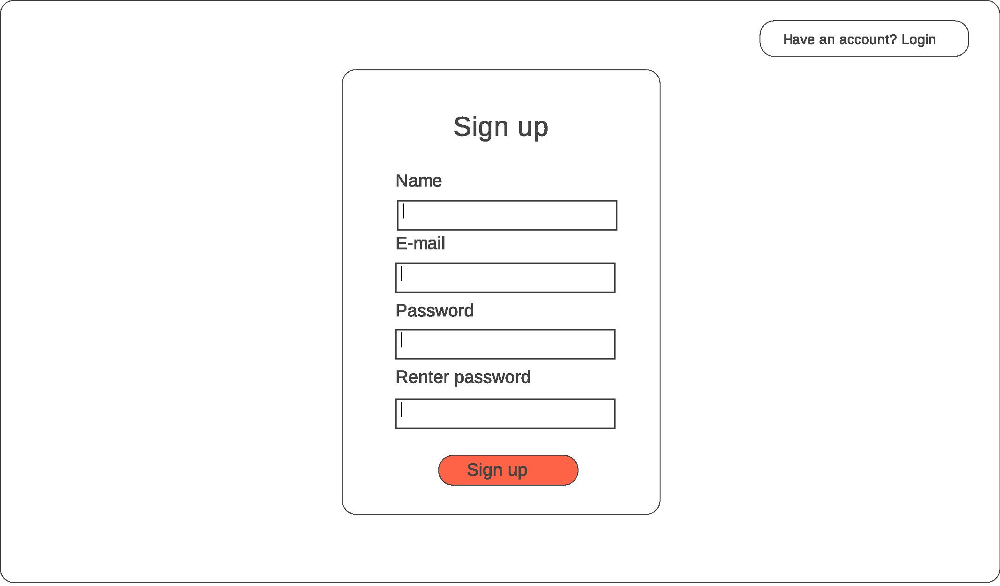
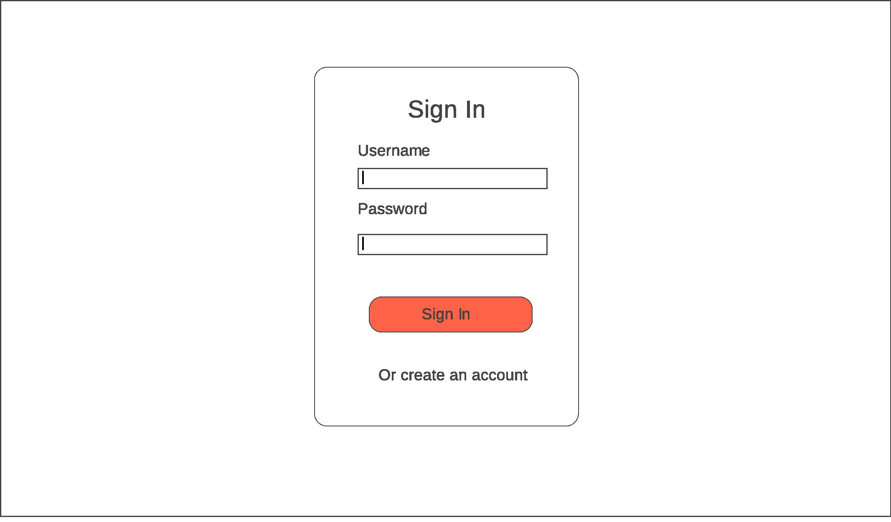
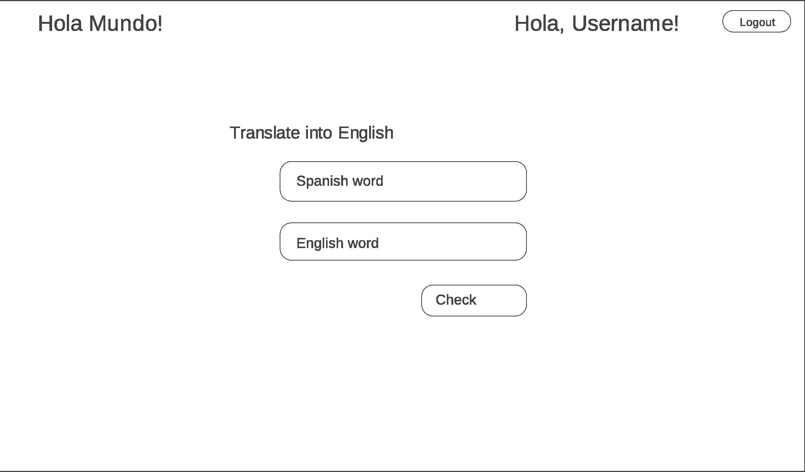
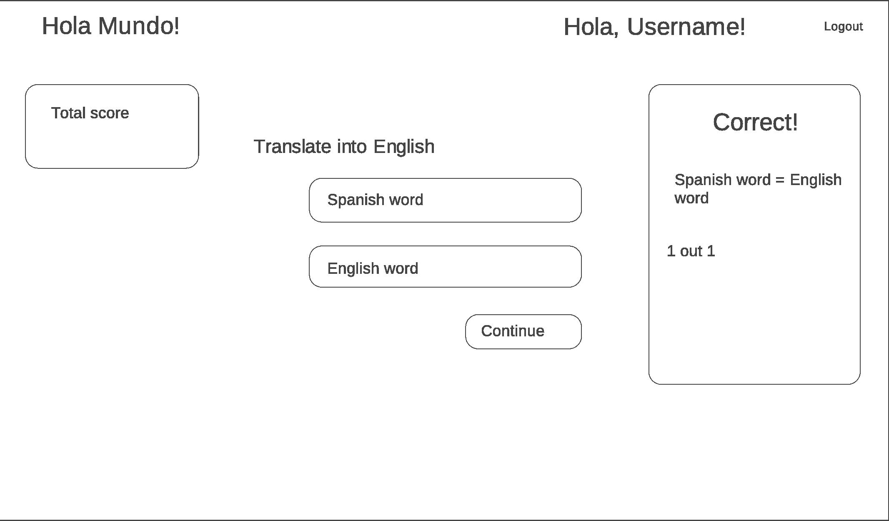
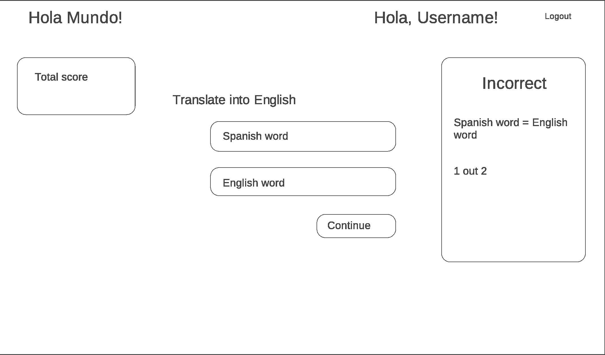
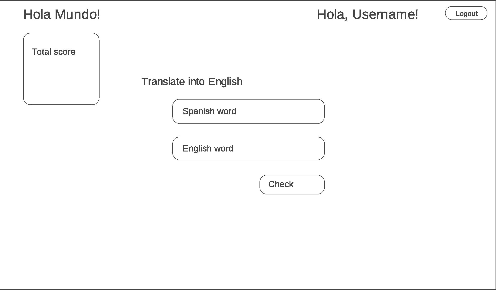

#

The purpose behind Hola Mundo was to create a full-stack app using Node.js for the back-end and React + Redux for the front end. The app includes JWT authentication and MongoDB for a no SQL database.

# Wireframe:

